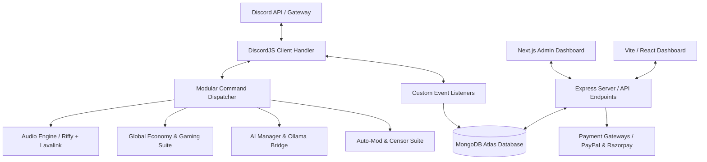

# Nishanka

A production-grade, multi-module Discord application and full-stack management ecosystem. Nishanka integrates high-performance audio streaming, a global virtual economy, automated moderation, interactive mini-games, local LLM integrations, and a dedicated Next.js/Vite administration dashboard.

---

## Key Architectural Modules

Nishanka is structured as a modular, event-driven monolith. Below is a high-level view of how components interact:



### 1. High-Performance Audio Engine (`lavalink / Riffy`)
- Powered by the **Riffy** Lavalink library for low-latency, multi-node audio streaming.
- Support for complex playback queues, looping configurations, lyrics fetcher, dynamic track metadata rendering, and backup node failovers.

### 2. Global Economy & Social Simulation ("Baubles")
- Custom state management using **Mongoose** models tracking transactions, balances, user profile cards, and achievements.
- Economy loops: daily checklist claims, garbage digging, custom collections, and bauble battles.
- Relationship social features: adoption, disown, marriage, and divorce tracking.

### 3. Integrated Casino & Minigames Suite
- Real-time multiplayer and single-player games: Blackjack, Buckshot Roulette, Coin Flip, Slots, Duck Race, and Grid Duels.
- Text-based and interactive mini-games: GeoGuesser, Guess the Flag, Hangman, Anime Battle, Mafia, Emoji Decode, and Scramble.

### 4. Enterprise-Grade Security & Auto-Moderation
- Custom anti-spam modules with configurable thresholds and auto-timeout durations.
- Advanced automated censors and text pattern scanners matching forbidden phrases.
- Guild logging, reaction role bindings, and verification gates.

### 5. Local AI Integrations (`ollama_bridge.js`)
- Integrated local LLM processing via a dedicated **Ollama** API bridge.
- Allows guild members to chat, play interactive AI-driven adventure games, and query contextual questions.

### 6. Full-Stack Web Control Center
- **Next.js Admin Dashboard (`/dashboard`)**: Next.js client for administrators to manage guilds, toggle bot settings, and view leveling leaderboards.
- **Vite Web Dashboard (`/dashboard-v2`)**: Client-side React application serving as a modern utility view.
- **Express Backend APIs**: Integrates Discord OAuth2 login flows, Razorpay/PayPal webhooks for premium donations, and Top.gg API voting loops.

---

## Tech Stack

- **Runtime Environment**: Node.js (v18+)
- **Primary Library**: Discord.js (v14)
- **Database Layer**: MongoDB (via Mongoose ODM)
- **Audio Streaming**: Lavalink API v4 with Riffy client
- **Frontend Dashboards**: Next.js (App Router), React, Vite, Tailwind CSS
- **Graphics & Rendering**: `@napi-rs/canvas` (High-performance Node canvas rendering for profile cards)
- **External APIs**: PayPal, Razorpay, Top.gg Webhooks, Ollama (Local AI)

---

## Folder Organization

```
nishanka/
├── commands/            # Command subdirectories (12 categories, 250+ commands)
│   ├── actions/         # Social actions (kiss, hug, bite)
│   ├── admin/           # Guild configuration, welcome messages, starboard
│   ├── casino/          # Blackjack, slots, buckshot roulette
│   ├── economy/         # Baubles, dumpster digging, daily bonuses
│   ├── minigames/       # GeoGuesser, hangman, battle arena
│   ├── music/           # Audio playback queues and Lavalink node controllers
│   └── moderation/      # Warn logs, timeouts, locks, censors
├── events/              # Event listeners (antiSpam, Ready, messageCreate)
├── models/              # Mongoose DB Schemas (32 collection layouts)
├── dashboard/           # Next.js control panel web app
├── dashboard-v2/        # Vite + React alternative control panel
├── utils/               # Utility modules (AI Manager, TTS, PayPal, Logging)
├── index.js             # Application entrypoint & Web Server initializer
├── deploy-commands.js   # Script to register slash commands with Discord API
└── ollama_bridge.js     # Bridge service connecting to local LLMs
```

---

## Setup & Installation

### Prerequisites
- Node.js (v18.0.0 or higher)
- MongoDB Instance (local or Atlas cluster)
- Active Lavalink Server Node (v4)
- Discord Bot Token (via [Discord Developer Portal](https://discord.com/developers/applications))

### Installation Steps
1. Clone the repository:
   ```bash
   git clone https://github.com/programmingxpert/nishanka.git
   cd nishanka
   ```

2. Install backend dependencies:
   ```bash
   npm install
   ```

3. Configure environment variables:
   Copy the `.env.example` file to `.env` and fill in your keys:
   ```bash
   cp .env.example .env
   ```

4. Register slash commands:
   ```bash
   node deploy-commands.js
   ```

5. Run the bot application:
   ```bash
   node index.js
   ```

---

## Future Improvements

- [ ] Migrate the core bot code to TypeScript for type safety across DB model schemas.
- [ ] Add unified logging using Winston or Pino instead of custom console logs.
- [ ] Implement Redis caching layer to offload Mongoose schema updates for fast economy actions.
- [ ] Refactor dashboard authentication to support JWT-based session validation.

---

## Author

**Satya**  
GitHub: [programmingxpert](https://github.com/programmingxpert/)
